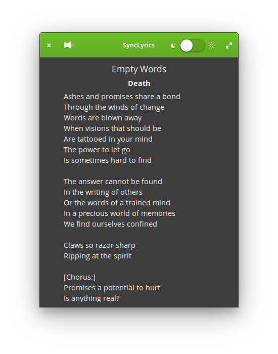

# SyncLyrics

Displays the lyrics of the currently played song on the Spotify. Works for Linux

<p align="center">
    <a href="https://github.com/onsah/SyncLyrics/releases">
        
    </a>
</p>

<p align=center> 
    
</p>

## Features
* Automatically retrieve the lyrics of the current song
* Pin the window so it doesn't fall back of other programs
* Change light/dark color modes

## Usage

In the first opening, you need to provide an api key from [here](https://happi.dev/)

## Installation

### From Binary

Download the `.deb` package from [here](https://github.com/onsah/SyncLyrics/releases)

Run
```
sudo dpkg -i package.deb
```

### From Source

#### Dependenices
Make sure these are installed before proceeding to install

* cargo
* meson
* libgtk-3-dev
* libglib2.0-dev
* libglib2.0-dev-bin
* libdbus-1-dev
* libssl-dev
* libcairo2-dev
* libpango1.0-dev
* libatk1.0-dev
* libgdk-pixbuf2.0-dev
* build-essential

If you are on an Ubuntu based distro, you can just run the following 
```
sudo apt install meson build-essential libglib2.0-dev libglib2.0-dev-bin libdbus-1-dev libssl-dev libcairo2-dev libpango1.0-dev libatk1.0-dev libgdk-pixbuf2.0-dev libgtk-3-dev
```

#### Build Instructions

```
meson build --prefix=/usr
cd build
ninja
```

Run with
```
./com.github.onsah.sync-lyrics
```

To install
```
ninja install
```

## TODO
* Cache the lyrics
* Being able to change the api key later
* Add app launcher shortcut
* Create Icon

## Credits

This application uses [happi](https://happi.dev/) api. It is only used for personal interests and I don't have any commercial profit from this application.

This project is inspired from [Lyrics](https://github.com/naaando/lyrics) source code and design.

## License

GPLv3

## Authors
Onur Şahin, sahinonur2000@hotmail.com