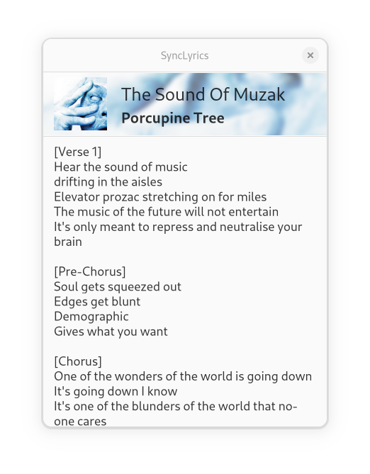

# SyncLyrics

Displays the lyrics of the currently played song on the Spotify. Works for Linux

<p align="center">
    <a href="https://github.com/onsah/SyncLyrics/releases">
        
    </a>
</p>

<p float="left" align=center> 
    
    
</p>

## Features
* Automatically retrieve the lyrics of the current song
* Pin the window so it doesn't fall back of other programs
* Change light/dark color modes

## Installation

### Flatpak installation

If you don't have flatpak, you need to install [flatpak](https://flatpak.org/) first.

Also you need to add [flathub](https://flatpak.org/setup/).

If you don't need the `org.freedesktop.Platform/20.08`, install with:
```
flatpak install flathub org.freedesktop.Platform//20.08
```

Download the application from [latest release](https://github.com/onsah/SyncLyrics/releases)

Run
```
flatpak install --user io.github.onsah.SyncLyrics.flatpak
```

You can launch from app launcher or run
```
flatpak run io.github.onsah.SyncLyrics
```

## From Source installation

### Flatpak

First [build with flatpak](#flatpak-build) then [install](#flatpak-installation).

### Meson

**Warning:** This is not the preferred way because the application may behave differently outside the sandbox environment. I don't recommend installing this way.

[Build with meson](#meson-build) then run:

```
ninja install
```
 
## Building

**Note:** To build manually you need to provide an access token from [here](https://genius.com/api-clients). Then put it in a file named `secret` in the project root.

### Flatpak build

Build the project and create the repository
```
flatpak-builder --repo=repo build-dir io.github.onsah.SyncLyrics.json --force-clean -y 
```

Bundle the repository
```
flatpak build-bundle repo io.github.onsah.SyncLyrics.flatpak io.github.onsah.SyncLyrics
```

Now you have installable binary. To run refer to [here](#flatpak-installation).

### Meson build

#### Dependencies

Make sure these are installed before building from meson

* cargo (>= 1.45)
* rustc
* meson
* libgtk-3-dev
* libglib2.0-dev
* libglib2.0-dev-bin
* libdbus-1-dev
* libssl-dev
* libcairo2-dev
* libpango1.0-dev
* libatk1.0-dev
* libgdk-pixbuf2.0-dev
* build-essential

Sometimes `cargo` may be out of date therefore build may fail. If you want to get latest `cargo` and `rustc` as debian package you can add the ppa from [here](https://launchpad.net/~ubuntu-mozilla-security/+archive/ubuntu/rust-updates)

#### Building

If you are on an Ubuntu based distro, you can just run the following 
```
sudo apt install meson build-essential libglib2.0-dev libglib2.0-dev-bin libdbus-1-dev libssl-dev libcairo2-dev libpango1.0-dev libatk1.0-dev libgdk-pixbuf2.0-dev libgtk-3-dev cargo rustc
```

```
meson build --prefix=/usr
cd build
ninja
```

Run with
```
./com.github.onsah.sync-lyrics
```

## TODO
* Cache the lyrics
* App icon

## Credits

This application uses [Genius](https://docs.genius.com/) api. It is only used for personal interests and I don't have any commercial profit from this application.

This project is inspired from [Lyrics](https://github.com/naaando/lyrics) source code and design.

## License

GPLv3

## Authors
Onur Şahin, sahinonur2000@hotmail.com